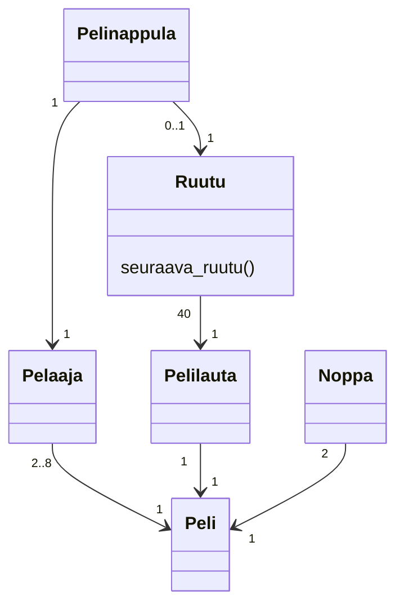

```mermaid
 classDiagram
      Pelaaja "2..8" --> "1" Peli
      Pelilauta "1" --> "1" Peli
      Noppa "2" --> "1" Peli
      Ruutu "40" --> "1" Pelilauta
      Pelinappula "1" --> "1" Pelaaja
      Pelinappula "0..1" --> "1" Ruutu
      class Ruutu{
      	seuraava_ruutu()
      }
```
