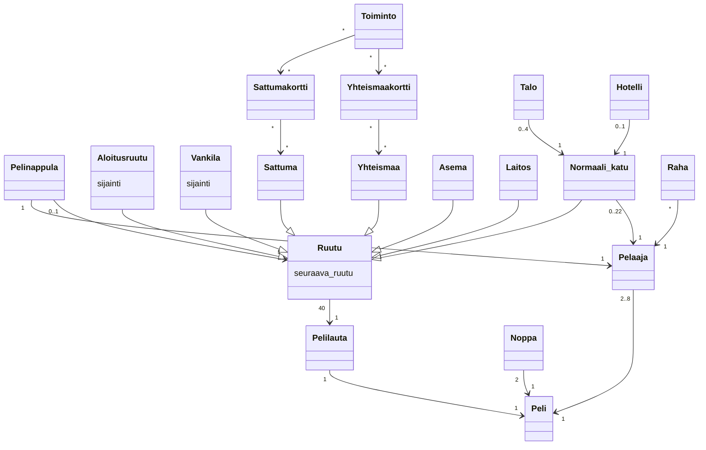

```mermaid
 classDiagram
      Pelaaja "2..8" --> "1" Peli
      Pelilauta "1" --> "1" Peli
      Noppa "2" --> "1" Peli
      Ruutu "40" --> "1" Pelilauta
      Pelinappula "1" --> "1" Pelaaja
      Pelinappula "0..1" --> "1" Ruutu
      Aloitusruutu --|> Ruutu
      Vankila --|> Ruutu
      Sattuma --|> Ruutu
      Yhteismaa --|> Ruutu
      Asema --|> Ruutu
      Laitos --|> Ruutu
      Normaali_katu --|> Ruutu
      Sattumakortti "*" --> "*" Sattuma
      Yhteismaakortti "*" --> "*" Yhteismaa
      Toiminto "*" --> "*" Sattumakortti
      Toiminto "*" --> "*" Yhteismaakortti
      Talo "0..4" --> "1" Normaali_katu
      Hotelli "0..1" --> "1" Normaali_katu
      Normaali_katu "0..22" --> "1" Pelaaja
      Raha "*" --> "1" Pelaaja
      class Ruutu{
      	seuraava_ruutu
      }
      class Aloitusruutu{
      	sijainti
      }
      class Vankila{
      	sijainti
      }
```
